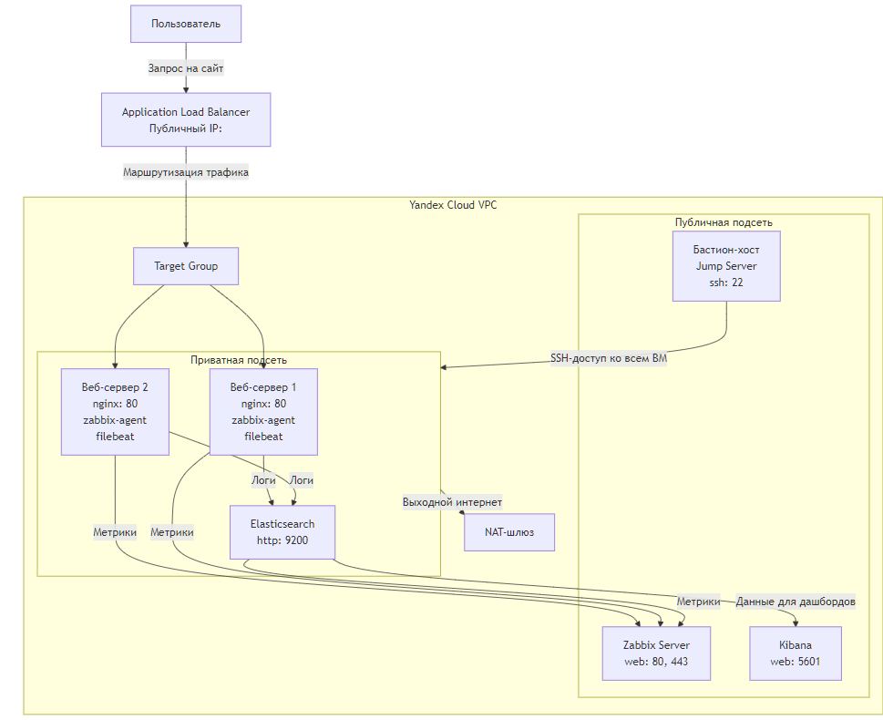

# 1. Структура проекта 
1. Блок-схема проекта (Высокоуровневая архитектура)

Эта схема показывает основные компоненты системы и их взаимодействие.
https://github.com/htment/DIPLOM/tree/main/diploma

# 2. 