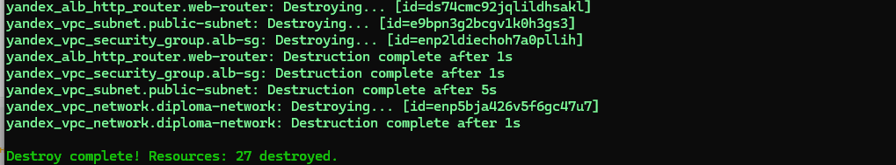

*Ключевая задача* — разработать отказоустойчивую инфраструктуру для сайта, включающую мониторинг, сбор логов и резервное копирование основных данных. Инфраструктура должна размещаться в Yandex Cloud и отвечать минимальным стандартам безопасности: запрещается выкладывать токен от облака в git

# Инфраструктура

Для развёртки инфраструктуры используйте Terraform и Ansible.

Не используйте для ansible inventory ip-адреса! Вместо этого используйте fqdn имена виртуальных машин в зоне ".ru-central1.internal". Пример: example.ru-central1.internal - для этого достаточно при создании ВМ указать name=example, hostname=examle !!

Важно: используйте по-возможности минимальные конфигурации ВМ:2 ядра 20% Intel ice lake, 2-4Гб памяти, 10hdd, прерываемая.

Так как прерываемая ВМ проработает не больше 24ч, перед сдачей работы на проверку дипломному руководителю сделайте ваши ВМ постоянно работающими.

Ознакомьтесь со всеми пунктами из этой секции, не беритесь сразу выполнять задание, не дочитав до конца. Пункты взаимосвязаны и могут влиять друг на друга.

## Сайт
- Создайте две ВМ в разных зонах, установите на них сервер nginx, если его там нет. ОС и содержимое ВМ должно быть идентичным, это будут наши веб-сервера.

- Используйте набор статичных файлов для сайта. Можно переиспользовать сайт из домашнего задания.

- Виртуальные машины не должны обладать внешним Ip-адресом, те находится во внутренней сети. Доступ к ВМ по ssh через бастион-сервер. Доступ к web-порту ВМ через балансировщик yandex cloud.

## Настройка балансировщика:

- Создайте Target Group, включите в неё две созданных ВМ.

- Создайте Backend Group, настройте backends на target group, ранее созданную. Настройте healthcheck на корень (/) и порт 80, протокол HTTP.

- Создайте HTTP router. Путь укажите — /, backend group — созданную ранее.

- Создайте Application load balancer для распределения трафика на веб-сервера, созданные ранее. Укажите HTTP router, созданный ранее, задайте listener тип auto, порт 80.

================================================================================================
# 1. Структура проекта 
1. Блок-схема проекта (Высокоуровневая архитектура)
[Схема](BLOCK-SCHEMA.mermaid)

Эта схема показывает основные компоненты системы и их взаимодействие.
https://github.com/htment/DIPLOM/tree/main/_OPISANIE/2_Razvorot_infra

# 2. Разворачиваем инфраструктуру
Описание настройки:
[Процесс развертывания](_OPISANIE/2_Razvorot_infra/README.md)
## Запускаем скрипт ``START.sh``

 Эта конфигурация создает полную отказоустойчивую инфраструктуру с мониторингом, сбором логов и резервным копированием в соответствии с требованиями задания.

 

# 3.  Тестирование сервисов

[Тестируем сервисы ](_OPISANIE/3_TEST/README.md)

# 5.  Уничтожение инфраструктуры:
## ``./STOP.sh/``
