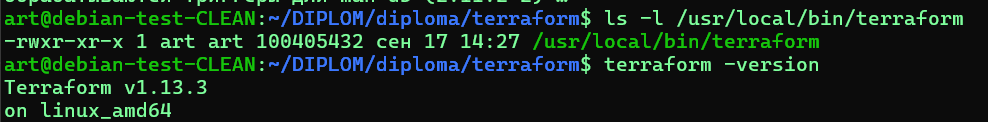
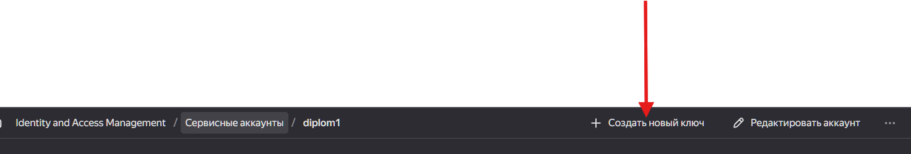
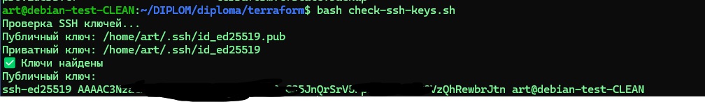
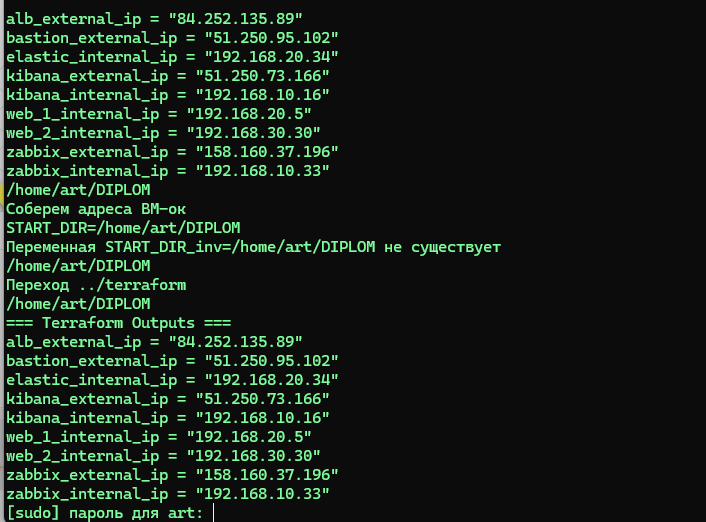
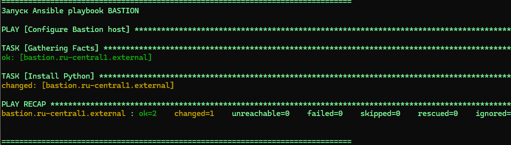
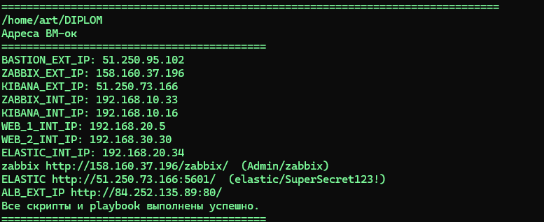
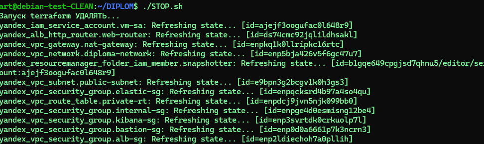
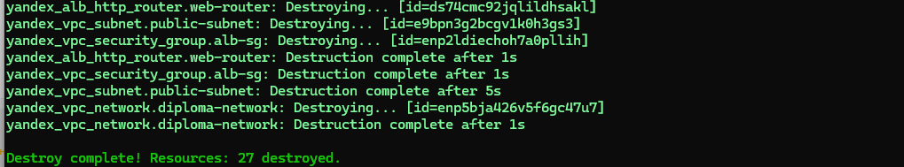

# 2.1. Получим структуру проекта


```
+-------------------------------------------------------------------------------------------------------+
|                                    Yandex Cloud                                                       |
|                                                                                                       |
|  +-------------------------------------+                                                              |
|  |            VPC: diploma-network     |                                                              |
|  | +---------------------------------+ |                                                              |
|  | |  Public Subnet: 192.168.10.0/24 | |                                                              |
|  | |                                 | |   +-------------------+                                      |
|  | |  [ Bastion ]                    | |   |  NAT Gateway      |                                      |
|  | |  - Public IP                    | |   | (shared_egress)   |                                      |
|  | |  - SSH (22)                     | |   +-------------------+                                      |
|  | |                                 | |           |                                                  |
|  | |  [ Zabbix ]                     | |           |                                                  |
|  | |  - Public IP                    | |   +-------|-----------+                                      |
|  | |  - Web (80,443)                 | |   | Route Table       |                                      |
|  | |  - Agent (10051)                | |   | 0.0.0.0/0 -> NAT  |                                      |
|  | |                                 | |   +-------------------+                                      |
|  | |  [ Kibana ]                     | |           |                                                  |
|  | |  - Public IP                    | |           |                                                  |
|  | |  - Web (5601)                   | |   +---------------------------------+                        |
|  | |                                 | |   |  Private Subnet: 192.168.20.0/24 |                        |
|  | |  [ ALB ]                        | |   |                                 |                        |
|  | |  - Public IP                    | |   |  [ Web-1 ]                      |                        |
|  | |  - Listener (80)                | |   |  - Private IP                   |                        |
|  | |                                 | |   |  - Nginx (80)                   |                        |
|  | +---------------------------------+ |   |  - Zabbix Agent (10050)         |                        |
|  |                                     |   |  - Filebeat                     |                        |
|  |                                     |   |                                 |                        |
|  |                                     |   |  [ Web-2 ]                      |                        |
|  |                                     |   |  - Private IP                   |                        |
|  |                                     |   |  - Nginx (80)                   |                        |
|  |                                     |   |  - Zabbix Agent (10050)         |                        |
|  |                                     |   |  - Filebeat                     |                        |
|  |                                     |   |                                 |                        |
|  |                                     |   |  [ Elasticsearch ]              |                        |
|  |                                     |   |  - Private IP                   |                        |
|  |                                     |   |  - ES (9200,9300)               |                        |
|  |                                     |   |                                 |                        |
|  |                                     |   +---------------------------------+                        |
|  +-------------------------------------+                                                              |
|                                                                                                       |
+-------------------------------------------------------------------------------------------------------+
    ↑               ↑               ↑               ↑               ↑
    |               |               |               |               |
    |               |               |               |               |
 SSH (22)       HTTP/HTTPS      HTTP/HTTPS      HTTP/HTTPS      Monitoring
    |               |               |               |               |
    |               |               |               |               |
 Admin User     End Users       Zabbix         Kibana Users     Zabbix Server
                             Administrators

+-------------------+   +-------------------+   +-------------------+
|   External        |   |   Data Flow       |   |   Backup          |
|   Connections     |   |   Internal        |   |   System          |
+-------------------+   +-------------------+   +-------------------+
| • SSH to Bastion  |   | • Web → ALB       |   | • Daily Snapshots |
| • HTTP to ALB     |   | • Web → Zabbix    |   | • 7-day retention |
| • HTTP to Zabbix  |   | • Web → Elastic   |   | • All VM Disks    |
| • HTTP to Kibana  |   | • Zabbix → Agents|   +-------------------+
+-------------------+   +-------------------+

```
# 2.2. Получим структуру папок 
```
diploma/
├── terraform/
│   ├── main.tf
│   ├── variables.tf
│   ├── outputs.tf
│   ├── terraform.tfvars.example
│   └── secret.auto.tfvars
├── ansible/
│   ├── inventory.yml
│   ├── bastion.yml
│   ├── webservers.yml
│   ├── zabbix.yml
│   ├── elk.yml
│   └── roles/
│       ├── nginx/
│       │   ├── tasks/
│       │   │   └── main.yml
│       │   ├── files/
│       │   │   └── index.html
│       │   ├── templates/
│       │   ├── handlers/
│       │   ├── vars/
│       │   └── defaults/
│       ├── zabbix-agent/
│       │   ├── tasks/
│       │   │   └── main.yml
│       │   ├── templates/
│       │   │   └── zabbix_agentd.conf.j2
│       │   ├── handlers/
│       │   ├── vars/
│       │   └── defaults/
│       ├── filebeat/
│       │   ├── tasks/
│       │   │   └── main.yml
│       │   ├── templates/
│       │   │   └── filebeat.yml.j2
│       │   ├── handlers/
│       │   ├── vars/
│       │   └── defaults/
│       ├── zabbix-server/
│       │   ├── tasks/
│       │   │   └── main.yml
│       │   ├── templates/
│       │   │   └── zabbix_server.conf.j2
│       │   ├── handlers/
│       │   ├── vars/
│       │   └── defaults/
│       ├── elasticsearch/
│       │   ├── tasks/
│       │   │   └── main.yml
│       │   ├── handlers/
│       │   ├── vars/
│       │   └── defaults/
│       └── kibana/
│           ├── tasks/
│           │   └── main.yml
│           ├── handlers/
│           ├── vars/
│           └── defaults/
├── scripts/
├── docs/
└── README.md
```

### 2.2.1 Cоздадим структуру 


```
# Создание основной директории
mkdir -p diploma

# Создание Terraform структуры
mkdir -p diploma/terraform
touch diploma/terraform/main.tf
touch diploma/terraform/variables.tf
touch diploma/terraform/outputs.tf
touch diploma/terraform/terraform.tfvars.example
touch diploma/terraform/secret.auto.tfvars

# Создание Ansible структуры
mkdir -p diploma/ansible/roles
touch diploma/ansible/inventory.yml
touch diploma/ansible/bastion.yml
touch diploma/ansible/webservers.yml
touch diploma/ansible/zabbix.yml
touch diploma/ansible/elk.yml

# Создание ролей Ansible
roles=("nginx" "zabbix-agent" "filebeat" "zabbix-server" "elasticsearch" "kibana")
for role in "${roles[@]}"; do
    mkdir -p diploma/ansible/roles/$role/{tasks,templates,files,handlers,vars,defaults}
    touch diploma/ansible/roles/$role/tasks/main.yml
done

# Создание конкретных файлов шаблонов
touch diploma/ansible/roles/zabbix-agent/templates/zabbix_agentd.conf.j2
touch diploma/ansible/roles/filebeat/templates/filebeat.yml.j2
touch diploma/ansible/roles/zabbix-server/templates/zabbix_server.conf.j2
touch diploma/ansible/roles/nginx/files/index.html

# Создание дополнительных директорий
mkdir -p diploma/scripts
mkdir -p diploma/docs
touch diploma/README.md

# Вывод созданной структуры
echo "Структура создана:"
find diploma -type f -name "*.tf" -o -name "*.yml" -o -name "*.j2" -o -name "*.html" -o -name "*.md" | sort

```

или так 
```
mkdir -p diploma/terraform diploma/ansible/roles/{nginx,zabbix-agent,filebeat,zabbix-server,elasticsearch,kibana}/{tasks,templates,files,handlers,vars,defaults} diploma/scripts diploma/docs && touch diploma/terraform/{main.tf,variables.tf,outputs.tf,terraform.tfvars.example,secret.auto.tfvars} diploma/ansible/{inventory.yml,bastion.yml,webservers.yml,zabbix.yml,elk.yml} diploma/ansible/roles/{nginx,zabbix-agent,filebeat,zabbix-server,elasticsearch,kibana}/tasks/main.yml diploma/ansible/roles/zabbix-agent/templates/zabbix_agentd.conf.j2 diploma/ansible/roles/filebeat/templates/filebeat.yml.j2 diploma/ansible/roles/zabbix-server/templates/zabbix_server.conf.j2 diploma/ansible/roles/nginx/files/index.html diploma/README.md
```
# 2.3.  Установка ansible
```
apt get install ansible
```
---------------------------------------------------------------
# 2.4. Установка terraform
скачаем архив
```
wget https://releases.hashicorp.com/terraform/1.2.1/terraform_1.2.1_linux_amd64.zip
```
распакуем
```
unzip terraform_*.zip
```
поместим в bin
```
sudo mv terraform /usr/local/bin/

```
проверим версию
```
terraform -version
```

---------------------------------------------------------------
Создаим файл .terraformrc в папке пользователя

```
provider_installation {
  network_mirror {
    url = "https://terraform-mirror.yandexcloud.net/"
    include = ["registry.terraform.io/*/*"]
  }
  direct {
    exclude = ["registry.terraform.io/*/*"]
  }
}

```

---------------------------------------------------------------


# 2.5. Создадим скачаем .authorized_key.json из YAndexCloud



---------------------------------------------------------------

Создаим файл terraform.tfvars с содержимым:

```
yandex_cloud_id  = "your_cloud_id"
yandex_folder_id = "your_folder_id"
# yandex_token     = "your_oauth_token"   # - сюда не добавляем прописан в  cloud-init.yml
```


# 2.6. Создадим providers.tf

```

provider "yandex" {
  cloud_id                 = var.yandex_cloud_id
  folder_id                = var.yandex_folder_id  
  service_account_key_file = file("~/.authorized_key.json")
  zone      = "ru-central1-a"
}
```

# 2.7. Cоздадим файл cloud-init.yml

## создалим пользователя user и админ 
```
#cloud-config
users:
  - name: user
    groups: sudo
    shell: /bin/bash
    sudo: ['ALL=(ALL) NOPASSWD:ALL']
    ssh_authorized_keys:
      - ВАШ ssh КЛЮЧ

  - name: admin
    groups: sudo
    shell: /bin/bash
    sudo: ['ALL=(ALL) NOPASSWD:ALL']
    lock_passwd: false
    passwd: "$6$rounds=4096$wPs2z7VqC9$X6q5h7W8pY2rT3sV1qZ9mN0bC4dF7gH2jK5lP8oR6tS9uY4vAxE3zB1cM6nDf"

ssh_pwauth: true
disable_root: false
chpasswd:
  list: |
    admin:123456
  expire: false
```




# 2.8. Развертывание инфраструктуры:
запускаем 
``START.sh``
```
./START.sh/
```

## Эта конфигурация создает полную отказоустойчивую инфраструктуру с мониторингом, сбором логов и резервным копированием в соответствии с требованиями задания.
 - Запуск Terraform apply -auto-approve
 - Сбор адресов ВМ-ок (создание external.sh)
 - Запуск diploma/ansible/CREATE_CONFIGS.sh
 - - Создание vars.yml
 - - Создание inventory.yml
 - - Создание filebeat.yml
 - - Создание elk.yml
 - - Создание zabbix-agent.yml



 - Запуск ролей ANSIBLE 
  -- Запуск Ansible playbook BASTION
  -- Установим ZABBIX-server
  -- Установим ZABBIX-agent
  -- Настроим web-сервера
  -- Установим ELK
  -- Поставим хосты на мониторинг

 -  Получаем итоговый результат:

```
echo "Адреса ВМ-ок"
bash ECHO_VARS.sh
echo "Все скрипты и playbook выполнены успешно."
echo "=========================================="

```

### Измените в main.tf для всех ВМ preemptible = true на preemptible = false


Выполните ``terraform apply`` для применения изменений

# 2.9. ДЛЯ  Уничтожения инфраструктуры:
```
./STOP.sh/
```




