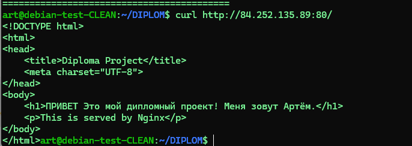

# 3. Проверка развернутой инфраструктуры


## Протестируем доступность всех созданных ресурсов:


*(пример вывода после отработки START.sh)*

## 3.1 Подключимся к джампу
``
ssh user@51.250.65.61
``


чтобы получить доступ к остальным хостам нужно подложить приватный ключ с локальной машины 


теперь можем подключаться так:


``ssh -J user@51.250.65.61 user@kibana``

``ssh -J user@51.250.65.61 user@zabbix``

``ssh -J user@51.250.65.61 user@web-1``

``ssh -J user@51.250.65.61 user@web-2``

## 3.2.   Проверка работы сайта

 http://публичный IP балансера:80/
 
 

 ## 3.2.   Проверка работы ZABBIX
 http://158.160.110.156/zabbix/
 


 ### Проверим, что хосты добавились на мониторинг 

 

  zabbix не мониторит сам себя. Поправим настроки агента на  локалный сервер
```
ssh -J user@51.250.65.61 user@zabbix
sudo nano /etc/zabbix/zabbix_agentd.conf
```

```
sudo systemctl restart zabbix-agent.service
```
видим


### Проверим что правило autodescovery создано:
 

проверим что метрики есть 


## 4. Провериим работу ELASTIC


если из logstash поступают данные то видим это: 
 
создаем 


Видим логи nginx


#### Выполним проверки 

- Базовая доступность

```
GET /
```

- Статус кластера
```
GET /_cluster/health
```
- Список узлов
```
GET /_cat/nodes?v
```
- Список индексов
```
GET /_cat/indices?v
```
- Статистика кластера
```
GET /_cluster/stats?human
```

